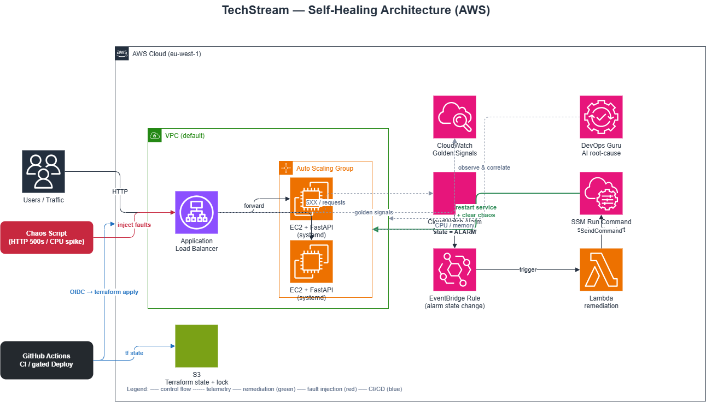
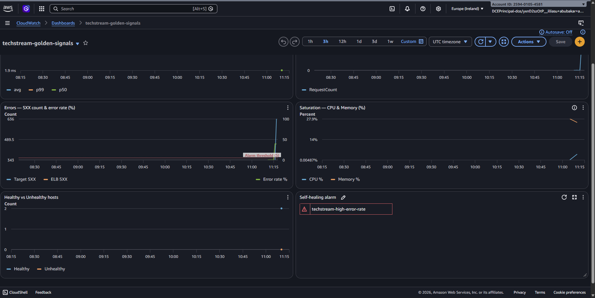
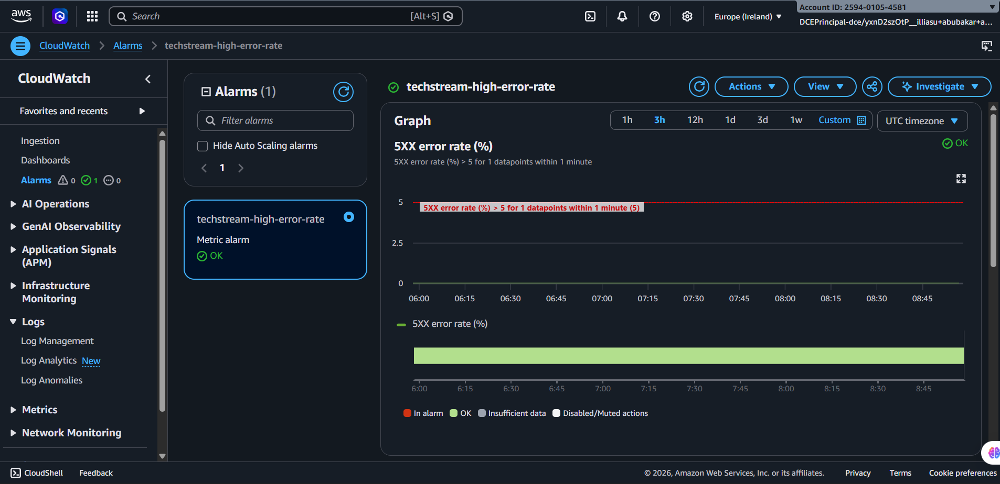
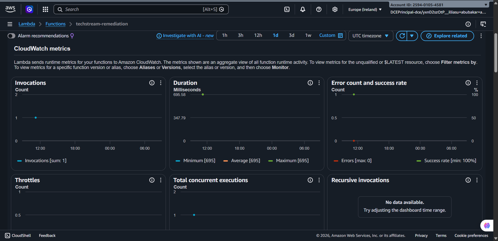
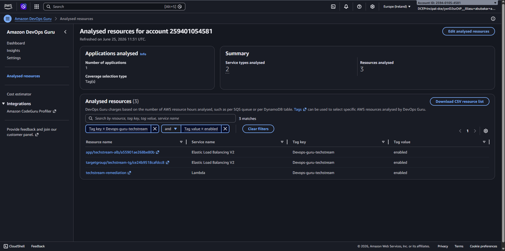
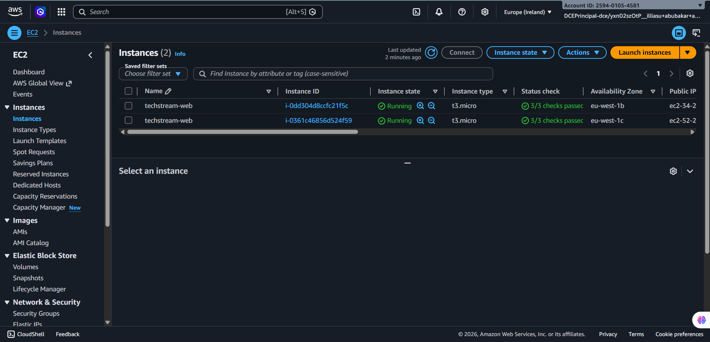
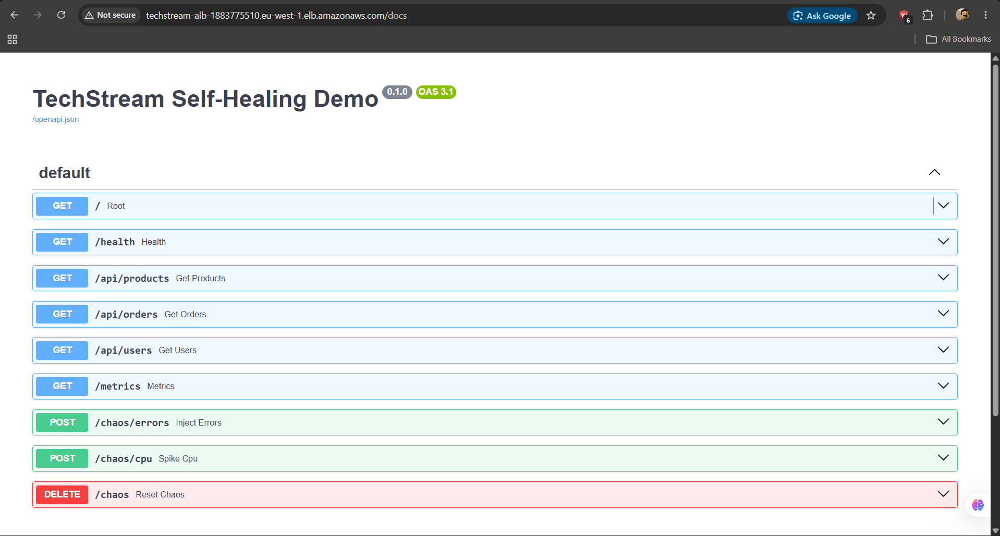

# TechStream — The Self-Healing System

A working lab that reduces **Mean Time To Resolution (MTTR)** by detecting
anomalies and remediating them automatically — before an engineer is paged.

It implements all four lab objectives on **AWS** with a **FastAPI** web tier:

1. **Golden Signal monitoring** — CloudWatch dashboard (Latency, Traffic, Errors, Saturation)
2. **Anomaly injection** — a chaos script that spikes CPU and generates HTTP 500s
3. **Alerting + self-healing** — CloudWatch alarm → EventBridge → Lambda → SSM Run Command restarts the service
4. **AI analysis** — Amazon DevOps Guru correlates the anomaly and produces a root-cause insight

---

## Architecture



> Editable source: [docs/architecture.drawio](docs/architecture.drawio) (built with the AWS architecture icon set).

**The self-healing loop:** the chaos script injects faults → the ALB/EC2 emit
metrics to CloudWatch → the alarm trips at >5% error rate → EventBridge invokes
the Lambda → SSM restarts the `techstream` service on every instance → the alarm
clears, with no engineer paged. DevOps Guru watches the tagged stack in parallel
and produces an AI root-cause insight.

**Why the Golden Signals come from the ALB + EC2:** the Application Load
Balancer natively emits latency (`TargetResponseTime`), traffic
(`RequestCount`) and errors (`HTTPCode_Target_5XX_Count`), while EC2 emits
saturation (`CPUUtilization`). No custom metric plumbing is required — this is
the AWS-native approach.

---

## Repository layout

| Path | Purpose |
|------|---------|
| [app/](app/) | FastAPI web server with `/api/*` routes, `/health`, `/metrics`, and chaos endpoints |
| [infrastructure/terraform/](infrastructure/terraform/) | Root module — wires the child modules together |
| [infrastructure/lambda/handler.py](infrastructure/lambda/handler.py) | Remediation Lambda that restarts the service via SSM |
| [chaos/chaos.py](chaos/chaos.py) | Standard-library chaos injector (no pip install needed) |
| [scripts/](scripts/) | `deploy.sh` and `watch-remediation.sh` helpers |
| [docker-compose.yml](docker-compose.yml) | Local smoke-test of the app before deploying |

### Terraform modules

The infrastructure is split into focused, reusable modules under
[infrastructure/terraform/modules/](infrastructure/terraform/modules/); the root
[main.tf](infrastructure/terraform/main.tf) composes them:

| Module | Responsibility |
|--------|----------------|
| `network` | Default VPC/subnet + AMI lookups, ALB and instance security groups |
| `web` | Launch template, Auto Scaling Group, ALB/target group/listener, instance IAM role |
| `monitoring` | Golden Signals dashboard + error-rate alarm |
| `remediation` | Lambda + IAM, EventBridge rule, SSM wiring (the self-healing action) |
| `devops-guru` | DevOps Guru tag-based resource collection |

Data flows between them via outputs: `network → web → monitoring → remediation`.

---

## Prerequisites

- An AWS account + credentials configured (`aws configure` or env vars)
- [Terraform](https://developer.hashicorp.com/terraform/downloads) >= 1.5
- AWS CLI v2
- Python 3.11+ (for the chaos script)
- (Optional) Docker, for local testing

> **Cost warning:** this stack runs an ALB, 1–3 `t3.micro` EC2 instances, and
> **Amazon DevOps Guru** (charged per resource-hour analyzed). Run
> `terraform destroy` when finished. Set `enable_devops_guru = false` to skip
> the most expensive component while you iterate.

---

## Step 0 — (Optional) Test locally first

```bash
docker compose up --build
curl http://localhost:8000/health
curl -X POST "http://localhost:8000/chaos/errors?rate=0.6"
curl http://localhost:8000/api/products      # ~60% will now return 500
curl -X DELETE http://localhost:8000/chaos    # clear it
```

---

## Step 1 — Deploy the stack

```bash
cd infrastructure/terraform
cp terraform.tfvars.example terraform.tfvars   # edit region / allowed CIDR
terraform init
terraform apply
```

Or use the helper: `./scripts/deploy.sh`

When it finishes, note the outputs:

```bash
terraform output alb_url          # e.g. http://techstream-alb-123.eu-central-1.elb.amazonaws.com
terraform output dashboard_url    # direct link to the Golden Signals dashboard
```

Give the instances ~2–3 minutes to boot, install the app, and pass health
checks. Confirm:

```bash
curl "$(terraform output -raw alb_url)/health"
```

---

## Step 2 — Watch the Golden Signals

Open the **dashboard_url** output in the AWS console. You'll see Latency,
Traffic, Errors (with a 5% threshold line), Saturation, host health, and the
self-healing alarm.

Generate some baseline traffic so the graphs come alive:

```bash
python chaos/chaos.py --url "$(terraform output -raw alb_url)" traffic --duration 120
```

---

## Step 3 — Inject an incident and watch it self-heal

In one terminal, start tailing the remediation pipeline:

```bash
./scripts/watch-remediation.sh
```

In another, inject failures:

```bash
python chaos/chaos.py --url "$(terraform output -raw alb_url)" errors --rate 0.7 --duration 300
```

What happens, end to end:

1. The ALB starts recording **5XX errors**; error rate climbs past **5%**.
2. The CloudWatch alarm **`techstream-high-error-rate`** flips to **ALARM**.
3. EventBridge matches the alarm-state-change event and invokes the Lambda.
4. The Lambda issues an **SSM Run Command** that runs
   `systemctl restart techstream` (and clears the injected chaos) on every
   tagged instance.
5. The service comes back clean, 5XX drops, and the alarm returns to **OK** —
   **no engineer was paged.**

You'll see the Lambda invocation and the dispatched SSM command id in the
tailed logs, and the alarm recovering on the dashboard.

You can also test the Lambda directly:

```bash
aws lambda invoke --function-name "$(terraform output -raw remediation_lambda)" \
  --payload '{"alarmName":"manual-test"}' --cli-binary-format raw-in-base64-out /dev/stdout
```

---

## Step 4 — AI root-cause analysis with DevOps Guru

DevOps Guru was enabled during `apply` (scoped by the `Devops-guru-techstream`
tag). It needs a baseline (allow ~2 hours of normal traffic for best results),
then:

1. Re-run the chaos script to create an anomaly:
   ```bash
   python chaos/chaos.py --url "$(terraform output -raw alb_url)" errors --rate 0.8 --duration 600
   ```
2. Open **DevOps Guru → Insights → Reactive** in the console.
3. Open the generated insight showing the anomaly correlation (high 5XX +
   latency + the affected ALB/ASG resources and the timeline).
4. **Export** it: use *Share / Export* in the console, or pull it via CLI:
   ```bash
   aws devops-guru list-insights \
     --status-filter 'Closed={Type=REACTIVE},Ongoing={Type=REACTIVE}'
   aws devops-guru describe-insight --id <INSIGHT_ID>
   ```

---

## Demonstration & Evidence

The self-healing loop was exercised end to end against the live stack. The chaos
script drove the error rate to **39%**, the alarm tripped, and the system
recovered **on its own in ~4 minutes** — no engineer paged.

**Measured incident timeline (one chaos run):**

| Time (UTC) | Alarm state | What happened |
|------------|-------------|---------------|
| `11:18:52` | `OK` | Healthy baseline |
| `11:19:13` | `ALARM` | Error rate hit 39% (> 5% threshold) |
| `11:19:10` | — | EventBridge invoked the Lambda; SSM restarted both instances |
| `11:23:23` | `OK` | Service recovered — **self-heal complete** |

---

### 1. Golden Signals monitoring

The CloudWatch dashboard during the incident — latency, traffic, errors and
saturation on one screen. The **Errors** widget shows the 5XX rate spiking past
the red **5% alarm threshold**, and the **Self-healing alarm** widget is red
(in `ALARM`). Two hosts report healthy throughout.



### 2. The error-rate alarm firing

The `techstream-high-error-rate` alarm in the **In alarm** state once the 5XX
error rate crossed 5%.



### 3. Automated remediation (alarm → EventBridge → Lambda → SSM)

The remediation Lambda fired exactly once and succeeded (100% success rate),
triggered automatically by the alarm.



The Lambda log and the SSM Run Command confirm the restart was dispatched to
**both** instances automatically:

```text
Remediation triggered. detail-type: "CloudWatch Alarm State Change"
  reason: error rate 39.07% was greater than the threshold (5.0)
Restarting techstream on instances: ['i-0dd304d8ccfc21f5c', 'i-0361c46856d524f59']
SSM command 0d03e746-... dispatched to 2 instance(s).

SSM Run Command  →  Status: Success
  Targets: i-0361c46856d524f59, i-0dd304d8ccfc21f5c
  Comment: "Self-healing restart triggered by techstream-high-error-rate"
```

### 4. AI analysis — DevOps Guru

DevOps Guru analyzing the stack, scoped by the `Devops-guru-techstream` tag —
the ALB, load balancer and Lambda are all under continuous AI observation for
anomaly correlation and root-cause insights.



### Supporting infrastructure

The Auto Scaling Group running two healthy FastAPI instances:



The deployed application (FastAPI Swagger UI) exposing the API and chaos
endpoints:



---

## CI/CD pipeline (GitHub Actions)

Two workflows live in [.github/workflows/](.github/workflows/):

- **[ci.yml](.github/workflows/ci.yml)** — runs on every push and PR. Lints and
  byte-compiles the Python, runs `terraform fmt`/`validate`, and builds the
  Docker image. Never touches AWS.
- **[deploy.yml](.github/workflows/deploy.yml)** — on push to `main` it runs
  `terraform plan`, then waits for a **manual approval** before `terraform
  apply`. Authentication uses **GitHub OIDC** (short-lived tokens, no stored AWS
  keys).

### One-time setup

**1. Create the OIDC trust + deploy role in AWS** (run once, with admin creds):

```bash
cd infrastructure/github-oidc
terraform init
terraform apply -var="github_repo=YOUR_ORG/YOUR_REPO" -var="state_bucket=techstream-terraform-state"
terraform output deploy_role_arn   # copy this ARN
```

**2. Add repository variables** (GitHub repo → Settings → Secrets and variables
→ Actions → *Variables*):

| Variable | Value |
|----------|-------|
| `AWS_REGION` | `eu-west-1` |
| `TF_STATE_BUCKET` | `techstream-terraform-state` |
| `AWS_DEPLOY_ROLE_ARN` | the `deploy_role_arn` from step 1 |

**3. Create the approval gate** (GitHub repo → Settings → Environments → **New
environment** named `production`): enable **Required reviewers** and add
yourself. The `apply` job pauses here until you approve.

After that, every push to `main` plans automatically and waits for your click to
deploy.

> The OIDC deploy role uses broad, service-scoped permissions for this lab.
> Tighten them to specific resource ARNs for production use.

---

## Teardown

```bash
cd infrastructure/terraform
terraform destroy
```

> DevOps Guru analysis may linger briefly after the resources are gone; confirm
> in the console that the resource collection is removed.

---

## How each lab objective is satisfied

| Lab requirement | Where it lives |
|-----------------|----------------|
| Deploy a buggy web server | [app/main.py](app/main.py) + ASG in [modules/web/](infrastructure/terraform/modules/web/) |
| Dashboard the 4 Golden Signals | [modules/monitoring/](infrastructure/terraform/modules/monitoring/) (`aws_cloudwatch_dashboard`) |
| Chaos script (CPU + 500s) | [chaos/chaos.py](chaos/chaos.py) + `/chaos/*` endpoints |
| Alarm when error rate > 5% | `aws_cloudwatch_metric_alarm.error_rate` (metric math) |
| Alarm → EventBridge → remediation | [modules/remediation/](infrastructure/terraform/modules/remediation/) |
| Lambda / SSM restarts the service | [handler.py](infrastructure/lambda/handler.py) (`AWS-RunShellScript`) |
| AI analysis (DevOps Guru) | [modules/devops-guru/](infrastructure/terraform/modules/devops-guru/) |
